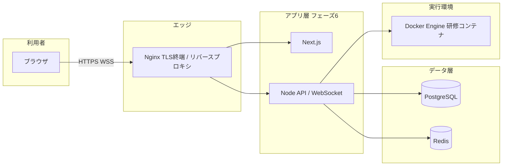

# Linux コマンド研修アプリ インフラ構成書（フェーズ5）

## 1. 文書概要

### 1-1. 目的
本書は、`01_要件定義書` / `02_基本設計書` / `04_詳細設計書` に基づき、開発・検証・本番想定のインフラ構成、ネットワーク、TLS、監視・ログの最低限、および受入観点を定義する。

### 1-2. DB 製品
**PostgreSQL** を採用する（プロジェクトで確定）。

### 1-3. 成果物の置き場所
リポジトリ内 `infra/` に Docker Compose・Nginx 設定・スクリプトを配置する。

---

## 2. 論理構成

---

## 3. コンポーネント一覧

| コンポーネント | 役割 | 本リポジトリでの提供 |
|----------------|------|----------------------|
| PostgreSQL 15 | 永続データ（ユーザー・課題・ログ等） | `infra/docker-compose.yml` |
| Redis 7 | セッション・レート制限等 | 同上 |
| Nginx | HTTPS 終端、HTTP→HTTPS、WebSocket アップグレード、`/api` `/ws` の振り分け | `infra/nginx/` |
| Docker Engine | 受講者コンテナの起動・制限 | ホスト OS に依存（`infra/docker/daemon.json.example` 参照） |
| アプリ（Next / Node） | 画面・API・コンテナ制御 | フェーズ6で追加 |

---

## 4. ネットワーク・ポート

### 4-1. 開発用 Compose（既定）

| 公開 | バインド | サービス |
|------|----------|----------|
| 5432 | 127.0.0.1 | PostgreSQL |
| 6379 | 127.0.0.1 | Redis |
| 80 | 全インターフェース | Nginx（HTTP） |

DB / Redis は **localhost のみ** にバインドし、不要な外向き公開を避ける。

### 4-2. 本番の考え方
- DB / Redis は **アプリサブネットのみ** から到達可能にし、インターネットに晒さない。
- Nginx 前段に WAF / セキュリティグループで **443 のみ** を許可する想定。

---

## 5. TLS（HTTPS / WSS）

### 5-1. 方針
- 要件定義 8-4 に従い、**HTTPS** および **WSS** を本番で必須とする。
- 開発では `infra/scripts/gen-selfsigned-certs.sh` による自己署名、または mkcert を利用可能。

### 5-2. Nginx
- `Upgrade` / `Connection` ヘッダを WebSocket 用に転送する（`04_詳細設計書` 5-3 と整合）。
- 長時間接続のため `proxy_read_timeout` を十分長く設定する（`infra/nginx/conf.d/default.conf` 参照）。

### 5-3. 本番での証明書取得例
- AWS: ACM（ALB 終端）または ALB 手前で Nginx
- オンプレ: Let's Encrypt（certbot）、社内 CA

---

## 6. Docker ホスト（研修コンテナ用）

### 6-1. 前提
- 受講者ごとの Linux コンテナを **非特権** で動かす（要件・基本設計）。
- 同時 30 人・余剰含め 35〜40 コンテナ程度を想定（要件定義 9 章）。

### 6-2. デーモン設定
- `infra/docker/daemon.json.example` を参考に、コンテナログのローテーションを設定し、ディスク枯渇を防ぐ。
- CPU / メモリ上限は **コンテナ作成時** に付与（アプリ実装側）。ホスト全体のリソース監視は監視節で扱う。

### 6-3. Docker ソケット
- アプリが Docker API を利用する場合、**ソケットマウントは強い権限**を持つため、本番では専用ユーザーや API プロキシでの分離を検討する（`04_詳細設計書` の注意書きと同旨）。

---

## 7. 監視・ログ（最低限）

### 7-1. コンテナヘルスチェック
- PostgreSQL: `pg_isready`
- Redis: `redis-cli ping`
- Nginx: `nginx -t`（設定妥当性）

### 7-2. アプリ・業務監視（フェーズ6以降）
要件定義 13 章の対象に合わせ、少なくとも次を計測可能にする。

| 対象 | 例 |
|------|-----|
| Web / API 死活 | `/api/health`、LB ヘルスチェック |
| WebSocket | 接続数、アラート閾値 |
| Docker | 稼働コンテナ数、作成失敗 |
| ホスト | CPU / メモリ / ディスク |

### 7-3. ログ
- Nginx: `access_log` / `error_log`（コンテナ標準出力でも可）。
- アプリ: 構造化ログを集約（CloudWatch、Loki、ファイル等は環境依存）。

---

## 8. セキュリティ設定の見直し（チェックリスト）

- [ ] `.env` のパスワードが既定のままになっていない
- [ ] PostgreSQL / Redis がインターネットに直接公開されていない
- [ ] 本番で TLS が有効（自己署名をそのまま本番に使っていない）
- [ ] ファイアウォール / セキュリティグループで必要最小限のポートのみ開放
- [ ] Docker ソケットの取り扱い方針が合意されている
- [ ] バックアップ方針（PostgreSQL のスナップショット頻度・保持期間）が決まっている

---

## 9. インフラ受入（接続確認）

実施時は `infra/scripts/verify-infra.sh` を実行し、手順は **`docs/06_利用手順.md`** および `infra/README.md` に従う。

| 確認項目 | 期待結果 |
|----------|----------|
| `docker compose ps` | postgres / redis / nginx が Up |
| PostgreSQL | `pg_isready` が成功 |
| Redis | `PING` が `PONG` |
| Nginx | `nginx -t` が成功 |
| HTTP | `curl http://127.0.0.1/healthz` が `ok` |

アプリ起動後は、Nginx 経由で画面・API・WebSocket が期待どおり動作することを確認する（フェーズ6の受入に含める）。

---

## 10. 改訂履歴

| 版 | 日付 | 内容 |
|----|------|------|
| 1.0 | 2026-03-24 | 初版（infra ディレクトリと整合） |
| 1.1 | 2026-03-24 | 利用手順 `docs/06_利用手順.md` への参照を追記 |
